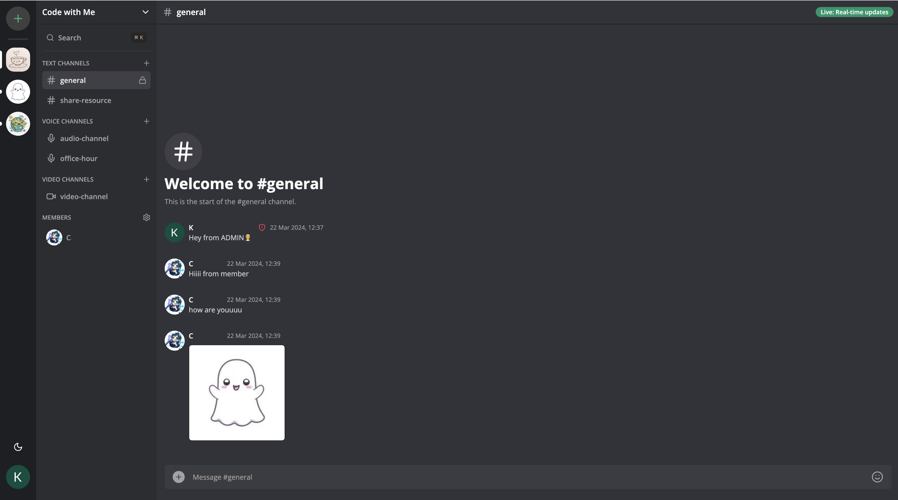
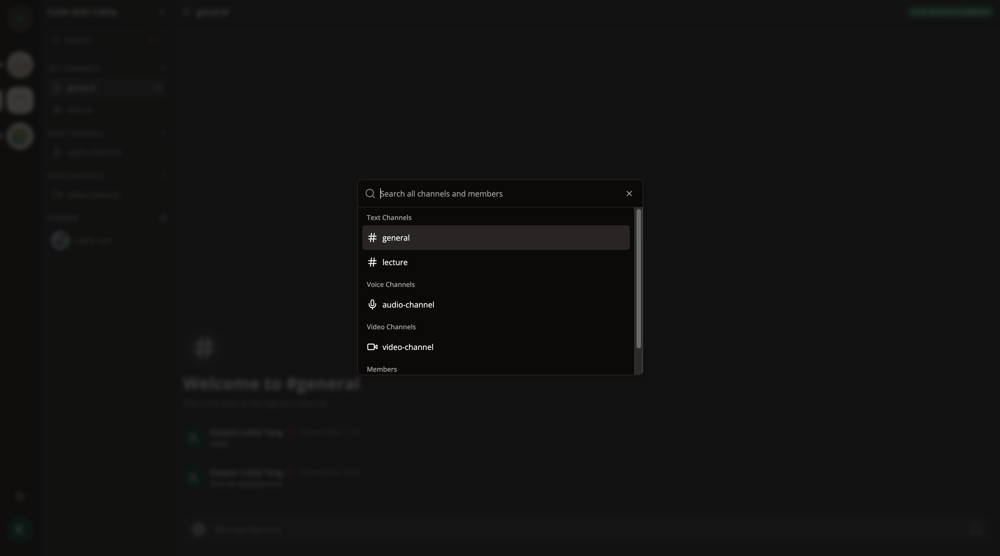
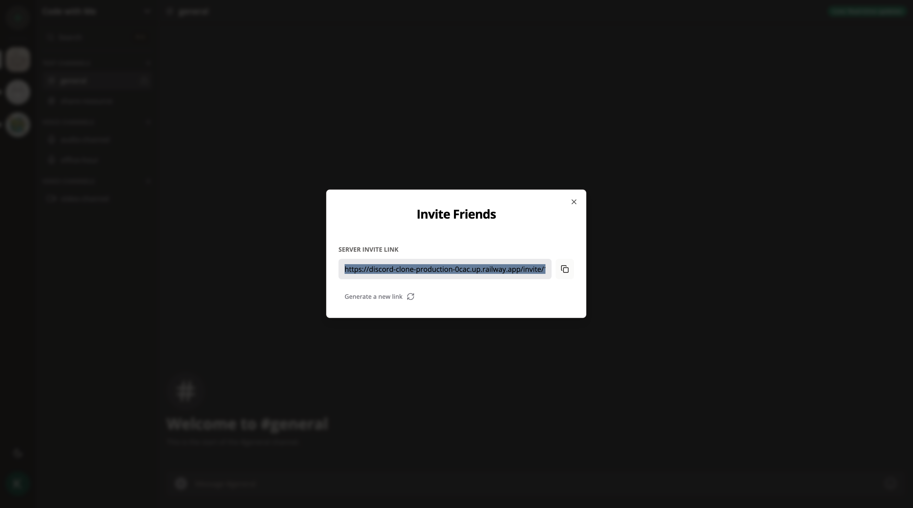
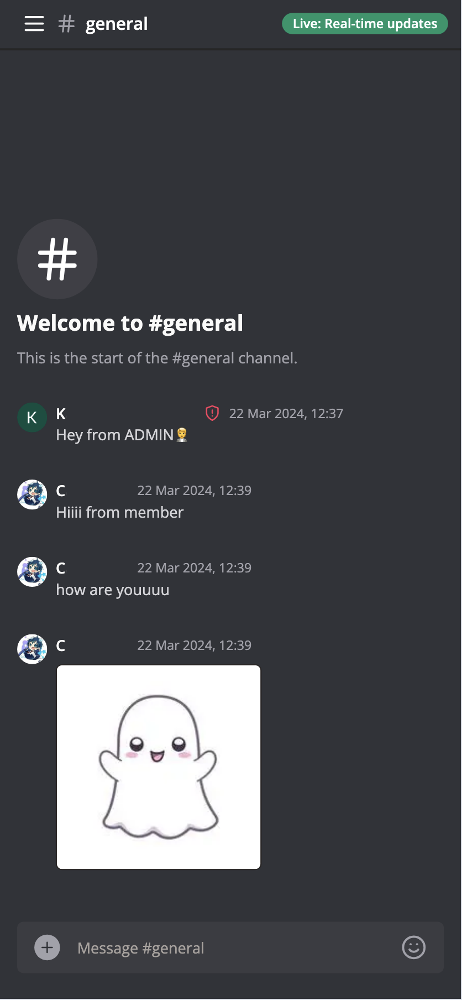
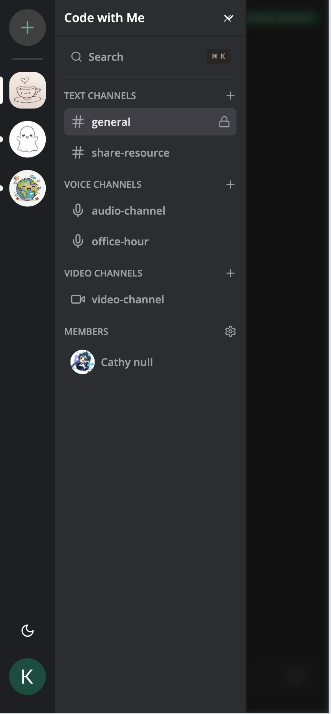

# Discord Clone
<a name="readme-top"></a>

This is a repository for Fullstack Discord Clone implemented with Next.js 13, React, Socket.io, Prisma, Tailwind, MySQL.

The live url: [https://discord-clone-production-0cac.up.railway.app](https://discord-clone-production-0cac.up.railway.app)

<!-- TABLE OF CONTENTS -->
<details>
  <summary>Table of Contents</summary>
  <ol>
    <li>
      <a href="#about-the-project">About The Project</a>
      <ul>
        <li><a href="#built-with">Built With</a></li>
      </ul>
    </li>
    <li>
      <a href="#getting-started">Getting Started</a>
      <ul>
        <li><a href="#prerequisites">Prerequisites</a></li>
        <li><a href="#installation">Installation</a></li>
        <li><a href="#run-the-app">Run</a></li>
      </ul>
    </li>
    <li><a href="#features">Features</a></li>
  </ol>
</details>

<!-- ABOUT THE PROJECT -->
## About The Project
  
  
  
<div style="display: flex; justify-content: flex-start;"width="400px">
  
  
</div>

<p align="right">(<a href="#readme-top">back to top</a>)</p>


### Built With

* Next.js 13
* React
* Socket.io
* Prisma
* Tailwind
* MySQL
* Shadcn

<p align="right">(<a href="#readme-top">back to top</a>)</p>


<!-- GETTING STARTED -->
## Getting Started

This is an example of how you may give instructions on setting up your project locally.
To get a local copy up and running follow these simple example steps.

### Prerequisites

Node version 18.x.x

### Installation

1. Clone the repo
   ```sh
   git clone https://github.com/github_username/repo_name.git
   ```
2. Install NPM packages
   ```sh
   npm install
   ```
3. Setup .env file
   ```js
    NEXT_PUBLIC_CLERK_PUBLISHABLE_KEY=
    CLERK_SECRET_KEY=
    NEXT_PUBLIC_CLERK_SIGN_IN_URL=
    NEXT_PUBLIC_CLERK_SIGN_UP_URL=
    NEXT_PUBLIC_CLERK_AFTER_SIGN_IN_URL=
    NEXT_PUBLIC_CLERK_AFTER_SIGN_UP_URL=


    DATABASE_URL=

    UPLOADTHING_SECRET=
    UPLOADTHING_APP_ID=

    LIVEKIT_API_KEY=
    LIVEKIT_API_SECRET=
    NEXT_PUBLIC_LIVEKIT_URL=
   ```
4. Setup Prisma
    ```sh
    // initiate and update database
    npx prisma migrate reset
    npx prisma generate
    npx prisma db push
    
    // check database
    npx prisma studio 
    ```
    
### Run the App

```sh
npm run dev
```

<p align="right">(<a href="#readme-top">back to top</a>)</p>


<!-- ROADMAP -->
## Features

- [ ] Real-time messaging using Socket.io
- [ ] Send attachments as messages using UploadThing
- [ ] Delete & Edit messages in real time for all users
- [ ] Create Text, Audio and Video call Channels
- [ ] 1:1 conversation between members
- [ ] 1:1 video calls between members
- [ ] Member management (Kick, Role change Guest / Moderator)
- [ ] Unique invite link generation & full working invite system
- [ ] Infinite loading for messages in batches of 10 (tanstack/query)
- [ ] Server creation and customization
- [ ] Beautiful UI using TailwindCSS and ShadcnUI
- [ ] Full responsivity and mobile UI
- [ ] Light / Dark mode
- [ ] Websocket fallback: Polling with alerts
- [ ] ORM using Prisma
- [ ] MySQL database using Planetscale
- [ ] Authentication with Clerk


<p align="right">(<a href="#readme-top">back to top</a>)</p>
